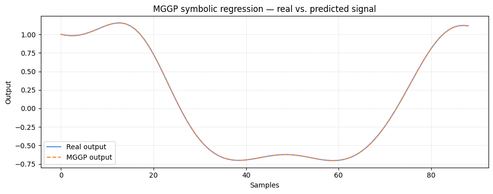

# MGGP (Multigene Genetic Programming)

[](https://github.com/RafaelGAT108/mggp_model/releases/tag/v0.0.3)
[](LICENSE)
[](https://codecov.io/gh/RafaelGAT108/mggp_model)

`mggp` is a Python implementation of **Multigene Genetic Programming (MGGP)** for interpretable symbolic modeling. The library is especially focused on **system identification**, **symbolic regression**, and **classification**, with support for static and dynamic formulations.

The package supports:

- Symbolic regression with explicit equations;
- Classification with one-hot encoded outputs;
- Dynamic system identification using NARX-like formulations;
- FIR/static modeling;
- SISO, MISO, and MIMO configurations;
- One-step-ahead, multi-shooting, free-run, and instant prediction modes.

---

## Installation

Install the package using the PIPL command:

```bash
pip install mggpy
```

After installation, the package can be imported as:

```python
from mggpy import MGGP
```

---

## Basic Data Format

The model expects NumPy arrays with samples in rows and variables in columns.

| Problem | Input `X` / `u` | Output `y` |
|---|---:|---:|
| SISO regression | `(n_samples, 1)` | `(n_samples, 1)` |
| MISO regression | `(n_samples, n_inputs)` | `(n_samples, 1)` |
| MIMO regression | `(n_samples, n_inputs)` | `(n_samples, n_outputs)` |
| Classification | `(n_samples, n_features)` | `(n_samples, n_classes)` one-hot |

For classification, labels must be converted to one-hot encoding before training.

---

# Tutorial 1 — Symbolic Regression For a Synthetic Dynamic System

This example generates a synthetic nonlinear SISO dynamic system and uses MGGP to identify an interpretable equation. The true system is:

```text
y[k] = 0.65*y[k-1] + 0.35*u[k] + 0.10*u[k]*y[k-1]
```

The goal is to recover an equation that predicts `y` from the input `u` and past output values.

## 1. Generate synthetic data

```python
import numpy as np
import matplotlib.pyplot as plt
from mggp import MGGP

np.random.seed(42)

n_samples = 300
t = np.linspace(0, 20, n_samples)

u = (np.sin(t) + 0.25 * np.sin(3 * t)).reshape(-1, 1)

y = np.zeros((n_samples, 1))

for k in range(1, n_samples):
    y[k, 0] = 0.65 * y[k - 1, 0] + 0.35 * u[k, 0] + 0.10 * u[k, 0] * y[k - 1, 0]

split = int(0.70 * n_samples)
u_train, u_test = u[:split], u[split:]
y_train, y_test = y[:split], y[split:]
```

## 2. Configure and Train MGGP

```python
mggp = MGGP(inputs=u_train,
            outputs=y_train,
            validation=(u_test, y_test),
            problem_type="regression",
            mode="NARX",
            evaluationMode="RMSE",
            evaluationType="MShooting",
            evaluationTypeTest="FreeRun",
            k=20,
            nDelays=1,
            generations=5,
            populationSize=30,
            nTerms=5,
            maxHeight=2,
            mutationRate=0.2,
            crossoverRate=0.9,
            elitePercentage=10,
            operators=["mul"],
            filename="best_mggp_regression.pkl",
)

mggp.run()
```

The example above uses a small population and few generations so it can run quickly. For real problems, increase `generations`, `populationSize`, and possibly `nTerms`.

## 3. Load the Best Model and Inspect the Symbolic Equation

```python
best_model = mggp.load_model("best_mggp_regression.pkl")

print("Identified equation:")
print(mggp.simplify_model(best_model))
```

A possible identified model is similar to:

```text
1.00000e-01 * y1[k-1] * u1[k] +
3.50000e-01 * u1[k] +
6.50000e-01 * y1[k-1] +
```

This is close to the synthetic equation used to generate the data.

## 4. Predict and Plot Real vs. MGGP Output Model

```python
yp_test, yd_test = best_model.predict("FreeRun", y_test, u_test)
rmse = best_model.score(yd_test, yp_test, "RMSE")

print(f"Test RMSE: {rmse:.6f}")

plt.figure(figsize=(10, 4))
plt.plot(yd_test[:, 0], label="Real output")
plt.plot(yp_test[:, 0], "--", label="MGGP output")
plt.xlabel("Samples")
plt.ylabel("Output")
plt.title("MGGP symbolic regression — real vs. predicted signal")
plt.legend()
plt.grid(True, linestyle="--", alpha=0.5)
plt.tight_layout()
plt.show()
```

---

# Tutorial 2 — Classification with Synthetic Data

This example creates a simple three-class classification problem. The classes are defined by the value of `x1 + x2`:

```text
Class 0: x1 + x2 < -0.5
Class 1: -0.5 <= x1 + x2 <= 0.5
Class 2: x1 + x2 > 0.5
```

For classification, MGGP expects the output matrix in one-hot format.

## 1. Generate a Synthetic Classification Dataset

```python
import numpy as np
from mggp import MGGP

np.random.seed(42)
rng = np.random.default_rng(42)

n_samples = 300
X = rng.uniform(-1, 1, size=(n_samples, 2))

s = X[:, 0] + X[:, 1]
y_labels = np.zeros(n_samples, dtype=int)
y_labels[s > 0.5] = 2
y_labels[(s >= -0.5) & (s <= 0.5)] = 1

n_classes = 3
Y = np.eye(n_classes)[y_labels]

idx = rng.permutation(n_samples)
train_size = int(0.80 * n_samples)
train_idx = idx[:train_size]
test_idx = idx[train_size:]

X_train, X_test = X[train_idx], X[test_idx]
Y_train, Y_test = Y[train_idx], Y[test_idx]
```

## 2. Configure and Train MGGP for Classification

```python
mggp = MGGP(inputs=X_train,
            outputs=Y_train,
            validation=(X_test, Y_test),
            problem_type="classification",
            classification_metric="accuracy",
            mode="FIR",
            evaluationType="INSTANT",
            evaluationTypeTest="INSTANT",
            nDelays=1,
            k=1,
            generations=5,
            populationSize=30,
            nTerms=6,
            maxHeight=2,
            mutationRate=0.2,
            crossoverRate=0.9,
            elitePercentage=10,
            operators=["mul"],
            filename="best_mggp_classifier.pkl",
)

mggp.run()
```

## 3. Evaluate the Trained Classifier

```python
def sample_accuracy(y_true_onehot, y_pred_onehot):
    true_labels = np.argmax(y_true_onehot, axis=1)
    pred_labels = np.argmax(y_pred_onehot, axis=1)
    return np.mean(true_labels == pred_labels)

best_model = mggp.load_model("best_mggp_classifier.pkl")
best_model.logistic_model = True

Y_pred, Y_true = best_model.predict_classes("INSTANT", Y_test, X_test)
acc = sample_accuracy(Y_true, Y_pred)

print(f"Test accuracy: {acc:.4f}")
print("Identified classifier equations:")
print(mggp.simplify_model(best_model))
```

```txt
Test accuracy: 0.8621
Identified classifier equations:
Output 1:
2.28724e-01 * 
-5.11180e-01 * u1[k] +
4.11911e-01 * u2[k] * u2[k] * u1[k] +
5.92781e-02 * u1[k-1] +
-4.67605e-01 * u2[k] +
1.78701e-01 * u1[k-1] * u1[k-1] +
Output 2:
5.59953e-01 * 
-2.72496e-03 * u2[k] +
-4.86901e-02 * u2[k-2] +
-3.18587e-01 * u1[k] * u1[k] +
-2.19767e-02 * u1[k] +
-1.02813e+00 * u2[k] * u1[k] +
Output 3:
2.84758e-01 * 
4.77110e-01 * u1[k] +
3.63570e-01 * u2[k] +

```
The classifier internally builds one symbolic expression per output class. The predicted class can be obtained with `argmax` over the one-hot output.

---

## Important Hyperparameters

| Hyperparameter | Meaning |
|---|---|
| `generations` | Number of evolutionary iterations. Higher values usually improve results but increase runtime. |
| `populationSize` | Number of candidate individuals in the population. |
| `nTerms` | Number of genes/terms in each MGGP individual. |
| `maxHeight` | Maximum height of each genetic programming tree. Controls expression complexity. |
| `nDelays` | Number of delayed terms available to the model. Useful for dynamic systems. |
| `mutationRate` | Probability of applying mutation. |
| `crossoverRate` | Probability of applying crossover. |
| `elitePercentage` | Percentage of the best individuals preserved between generations. |
| `evaluationMode` | Regression metric: `RMSE`, `MSE`, `MAPE`, or `NMSE`. |
| `evaluationType` | Training predictor: `OSA`, `MShooting`, `FreeRun`, or `INSTANT`. |
| `evaluationTypeTest` | Validation/test predictor. For dynamic regression, `FreeRun` is commonly used to evaluate simulation quality. |
| `mode` | Model formulation. Use `NARX` for dynamic regression and `FIR` for static/instant input-output mapping. |
| `operators` | Primitive operators used to construct symbolic terms, such as `mul`, `add`, `subtraction`, `sin`, `div`, `tanh`, and `sign`. |

---

## Practical Recommendations

For fast experiments:

```python
generations=5
populationSize=30
nTerms=5
maxHeight=2
```

For more serious modeling tasks:

```python
generations=50      # or more
populationSize=100  # or more
nTerms=10           # or more
maxHeight=3
```

Use small values first to verify that the data format, training configuration, and prediction pipeline are correct. Then increase the evolutionary budget.

For dynamic regression, prefer preserving temporal order in the train/test split. Avoid random shuffling unless the problem is static or the temporal dependence is not relevant.

For classification, use one-hot encoded output matrices and recover class labels with:

```python
labels = np.argmax(Y_pred, axis=1)
```

---

## Project Structure

```text
mggp_model/
├── src/
│   └── mggp/
│       ├── base.py
│       ├── crossings.py
│       ├── mggp.py
│       ├── mutations.py
│       ├── predictors.py
│       └── __init__.py
├── tests/
├── requirements.txt
├── pyproject.toml
└── README.md
```

---

## References

This implementation is based on MGGP methodology applied to symbolic modeling and system identification.

### Foundational works

**Multi-Gene Genetic Programming para Modelagem MIMO Não Linear das Vibrações de uma Aeronave F16 no Solo**

> DOS SANTOS, Rafael Ávila et al. Multi-Gene Genetic Programming para Modelagem MIMO Não Linear das Vibrações de uma Aeronave F16 no Solo.

**A Novel MIMO Multi-Gene Genetic Programming Approach for Interpretable NARX Models: an application to vehicle state estimation**

> HENRIQUE GROENNER BARBOSA, Bruno et al. A Novel MIMO Multi-Gene Genetic Programming Approach for Interpretable NARX Models: an application to vehicle state estimation.

---

## License

This project is licensed under the MIT License. See [`LICENSE`](LICENSE) for details.

---

## Contributing

Contributions are welcome. Feel free to open issues, propose improvements, or submit pull requests.
